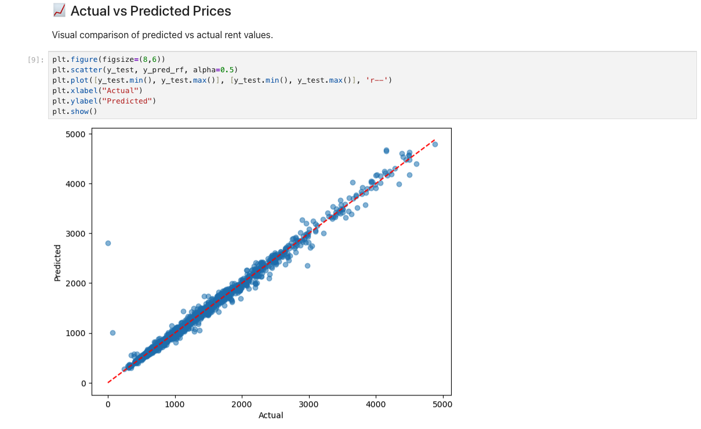
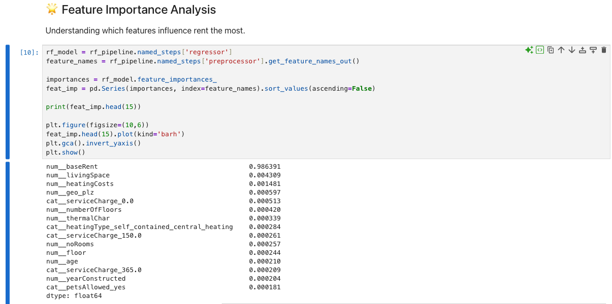
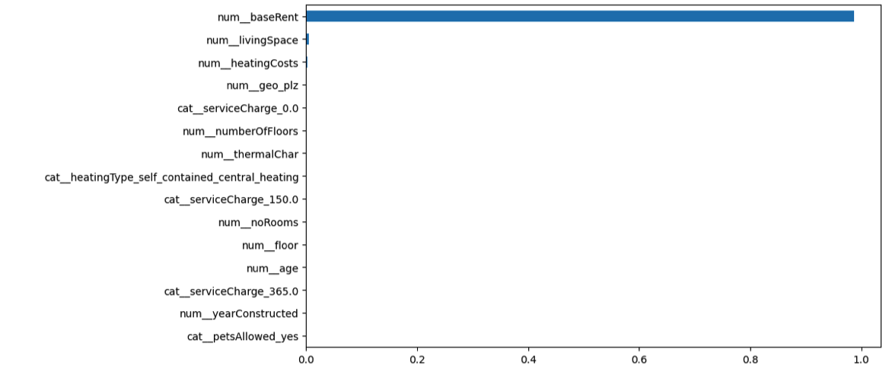

# 🏙️ Berlin Rent Price Prediction (2026)

🚀 End-to-end machine learning project with data preprocessing, modeling, and evaluation.

---

## 📌 Overview
This project predicts rental prices in Berlin using property features and machine learning models.

---

## 🧰 Tech Stack
- Python
- Pandas, NumPy
- Matplotlib, Seaborn
- Scikit-learn

---

## ⚙️ Workflow
1. Data Cleaning & Preprocessing  
2. Exploratory Data Analysis  
3. Feature Engineering  
4. Model Training  
5. Model Evaluation  

---

## 📊 Results
- Linear Regression → R²: 0.9861  
- Random Forest → R²: 0.9848  

## 📊 Model Output   

### Actual vs Predicted Prices


### Feature Importance Analysis

#### With Base Rent Included


#### Without Base Rent (Better Insight)


### 🔍 Interpretation

- The first plot shows that base rent dominates the prediction.
- After removing base rent, other features like living space and heating costs become more visible.
- This helps better understand secondary factors influencing rental prices.

## 🔍 Insights
- The model shows strong predictive performance...
---

## 🔑 Key Insights
- Base rent is the strongest predictor  
- Living space significantly impacts rent  
- Other features have smaller influence

## ⚠️ Limitations
While the model performs well, there are some limitations to consider:

- Model heavily depends on base rent, which is a direct component of total rent  
- External factors like location quality and market trends are not included  
- Dataset may not reflect real-time Berlin housing market dynamics

## 🚀 Future Improvements

- Include location-based features (district-level pricing)
- Experiment with advanced models (XGBoost, Gradient Boosting)
- Deploy as an interactive web app (Streamlit)

---

## ▶️ How to Run
```bash
pip install -r requirements.txt
